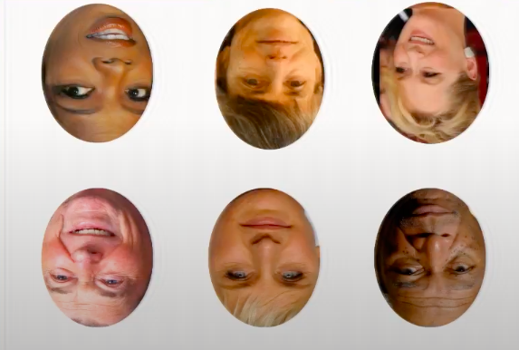
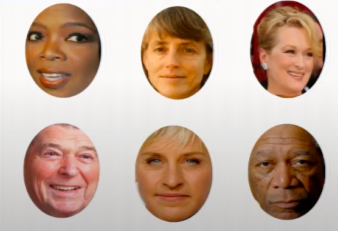
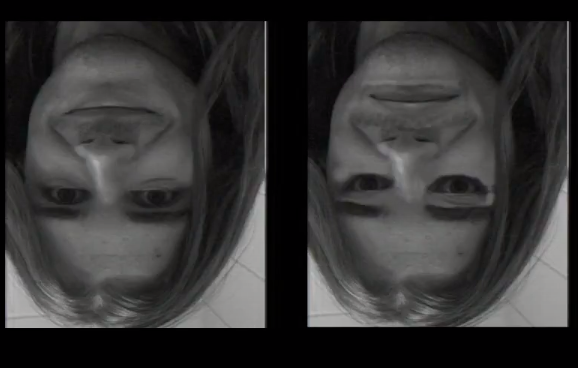
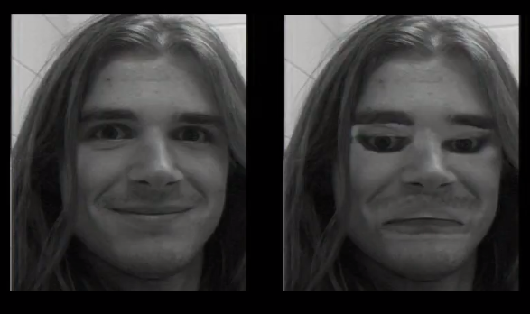

# Face Perception: Insights from Behavioral Experiments

At the level of computational theory for face perception we ask questions like:

- What is the nature of the problem of face perception? 
- What are the inputs what are the outputs? 
- What are the challenges in getting from the input to output? 

That's computational theory. 

At the level of representation and algorithms, we ask
- What is the nature of the representation that's extracted from from faces?
- Are those representations different in any fundamental way from the representations we extract for other kinds of things like for example when we look at words while reading, or when we look at scenes when we walk around in the world or when we look at objects to pick them up?
- Are those fundamentally the same kind of representation, or are they very different in some way and related to that is face recognition a distinct system from the rest of vision or cognition? 

The last question above is sort of a hardware implementation question that bares importantly on algorithm. Notice if you have two totally separate parts of mind and brain one for "face recognition" for example and another for "reading words" then when you if you know that at the hardware level. Now you're trying to think about what are the algorithms involved in face recognition. Well you already know a bunch! This algorithm that we have to think up only has to operate on faces it doesn't have to handle apples and toasters and buildings and cars and that already constrains what kind of representation an algorithm you'd come up with. You can see how the separateness of the systems at the hardware level constrains the way you would think about the algorithms. It tells you about the scope of operation. </br>


One of the hallmarks of face perception is that it's pretty fast. We're all with way under a second from the time it appeared and landed on your retina to when you knew who it was and that reaction time includes not just how long it takes for you to recognize the face but the extra time to say oh yeah I got it I guess I'm supposed to clap my hands now send a signal out your arm boom. So it's actually less than that, so it's pretty fast.
That's already a little bit of a kind of sort of clue right about algorithm whatever's happening it's fast,

All right, okay, so how did you do that you all just did it how would you do it? This is the funny thing about brains. Like we do this we have them we can watch them sort of sometimes they give us clues about how they work and sometimes they don't often it feels like just you look at the face and you know who that is and there's nothing more to be said about it. Sometimes you look at a face and you have a sense of how you knew. You know like Jack Nicholson's eyebrows or something like that. It's like oh yeah, I got the eyebrows I knew those Jack Nicholson something like that but often it just serves up. 
So that's why we need a science. 

We're gonna survey the methods: 
- one is you just think about the problem we just talked about that some and we'll talk about it a little bit more in a moment what are the inputs and outputs 
- another is run behavioral experiments more organized versions of what we just did asking people to do stuff and getting their responses and we can do that on so-called normal subjects 
- you can also run them on infants and children and all kinds of other people people with brain damage people whose brains are getting zapped while you do it and all kinds of other things we can monitor activity from the human brain 

And a whole alphabet soup of ever-increasing methods.. </br>

We can study the neural basis of the whole system in monkeys because monkeys can recognize faces too and though they're different from us in many ways, actually evidence increasingly suggests their face recognition system is very similar to ours and that's a good thing. Because there are even much more powerful methods that we can use in monkeys like recording from individual neurons than we can do in humans, because people don't like it when you stick electrodes in their heads. Okay so all of these super cool neuroscience methods are exciting and fascinating and kind of the hottest thing in the last 20-25 years in this field but let's start with the humblest lowest tech method around and that's first thinking and then measuring behavior and we will see how far we can get just from that. </br>

All right, an image of a perosn comes in, hits your retina, some magic happens inside your head and you know that's Julia Roberts or you spit out Brad or whoever. 

So the whole question is what's going on in the box. Okay so when I say at the level of computational theory we characterize the inputs we characterize the outputs that helps us figure out what is the mystery to be understood. The mystery is that box. 

Okay all right so now that we know that we could think about it doesn't seem that hard right? This should be really easy all you need to do to solve this problem is to have a bunch of templates right a bunch of little pixel representations that we can hold up hold it up to Julia see if it matches. If it does we say Julia. If it doesn't we don't. If it matches Brad, we say Brad right? Piece of cake just store a bunch of templates of the people we know right? </br>

Well you have this literal template, if it's a bunch of pixels the chance is approximately zero that that image will land on your retina ever again. Million ways that things change and they change the image that falls on your retina. 
Consider orientation. Orientation changes are bigger than identity changes right and that's just orientation. We have lighting changes, we have you know weird stuff that happens with hair, we have all kinds of expression changes all the time etc. 
So there are millions of changes so this is never gonna work. </br>
So this is the simple statement of this is that the same person or thing can look infinitely many different ways as it changes in all these different viewing conditions position on your retina distance and size.</br>

But we still managed what do we do. Well one possibility is we just memorize all of those, or a lot of them enough so that when when Julia comes along she'll match one of the ones we have. That seems kind of ludicrous. We have room in our head for all of that well who knows how many neurons that takes it sounds crazy but if we're enumerated the possibilities some version of that might be the case. But there's evidence that actually we kind of do something like this. </br>

The representation that we use in face recognition is more abstract it isn't like a template. It isn't like a bunch of pixels. It's like, it's something like unusually wide eye spacing or heart-shaped face outline or something like that. If you could extract those features from a face and store those then maybe all of these different. Or in Julia's case, for me like the diagnostic part is the upper lip. I don't know what it is with her upper lip but there's something very diagnostic right there. Whatever that is, if you could store that bit you could extract that from all of these. So maybe there's some more abstract featural representations of a face. 
I'm being very vague here but just something more abstract than pixels then all of those images would end up at the same representation and that would solve the problem of invariance right there. Those are just loose caricatures of strategies you might use to solve this problem. </br> 

So we just did all this thinking business. Let me give you a couple of really low tech ones we can ask. For example what kinds of things are  hard. You might have noticed that when a friend changes their hair, you detect that something's different but it often takes a while to figure what. The point is, you get a different signal; you don't get an analysis and so if what we had in our head was some kind of representation of this part, that part you might think that it'd be easier to analyze what that different signal was all about. That's just an example of something you experienced that might or might not be informative. </br>

Here's another one: You might have noticed that if you're in a situation where those bunch of mirrors, for example in a clothing store, that wants to show you all your angles of your fabulous self. And you see yourself in profile. And you think wow, is that what I look like in profile?! By profile, I mean side view. Yeah well what is that telling you. That's telling you have lots of experience looking at your self front on. Even if you're not incredibly vain it's hard to avoid running into mirrors and  seeing yourself in photographs. You rarely see yourself from the side. If what you were extracting about the face was some very invariant abstract description of the structure of the face you should be able to see that just as well from the side as the front so that suggests some lack of invariance in your face representation. Okay, again just from introspection. Of course introspection isn't enough. It's just a source of ideas once you get ideas you've got to get serious and run  experiments! </br>


So let's talk about some behavioral experiments what they tell us about face recognition. 
Robert Yin got his PhD in from MIT in 1969. Imagine the technology that was available then he used. The extraordinarily amazing and high-tech method of _paper and pencil_. He showed people pictures of faces, and scenes, and bodies, and other things and he asked them to recognize them. That was his method and he discovered really deep important things. 
He maybe not quite the first but one of the very first people to suggest that there might be special mechanisms in the brain for face recognition and he did that with paper and pencil that's awesome! </br>

Okay here's what he did. Here are six faces upside down and you're gonna look at them for a few seconds. Look at all of them and just make a tally of how many of them you recognize.



Next let's do it again with upright faces. Write down how many recognize.


Do you observe a difference?
That's the face inversion effect. Okay now I cheated in this demo it's important to cheat and demos otherwise they don't always work :p . I cheated in this demo by showing you the upright faces second but if you do this in a proper controlled experiment it works just as well people are much better able to recognize upright faces than inverted faces. That's what Robert Yan showed in 1969 it's called the face inversion effect. His experiment was a little you know more structured than what we did here. </br>

What he did was that he gave people a bunch of faces to study like twenty unfamiliar faces they hadn't seen before. They had a few seconds to study each one and that takes a few minutes. And then, he gives them a test; which of these two did you see before? And he measures how well people do. He does that whole thing with the faces up right or the whole thing with the faces inverted. That's better than the version we did just now because after all you probably haven't seen Ronald Reagan upside down before. And so okay that's unfamiliar but in Robert Yin's experiment, you'd study them inverted and test them inverted or study them upright and test them upright. That gave the system the same shot. Nonetheless, he found that people made more errors when the faces were inverted than when they were upright. </br>

Now does this tell us that faces are special? So you first see this and you think, oh that's weird, that's interesting, that sounds diagnostic, but you have to show that it's diagnostic you have to do the same thing on other classes of stimuli. If you want to use this as an argument not just to say that our representation of faces is orientation sensitive, (this does show that) but if we want to further say that does that make faces different, we have to test other things. And of course Robert Yin did that. </br>

Okay so here's what he found with four houses and stick figures of bodies. He found an inversion effect but it was smaller. So it's not like there is no inversion effect for things that aren't faces and much depends on the details of the experiment it's just a larger inversion effect for faces and other things. </br>

So it could hardly be more low-tech than this, but it really has a deep kernel of insight: both about the nature of the representations of faces we extract and have in our heads and about the idea that we that whatever we do with faces is somehow fundamentally different than what we do with non faces or at least may be different I don't know about fundamentally maybe slightly overstating it from this alone. </br> 

Robert Yin actually inferred from this that there are special brain mechanisms for face recognition which is pretty amazing back in back in 1969 with no scanner no nothing.


All right, okay so, here's another version of the face iversion effect so if you look at these two stimuli:


Just look at them for a while raise your hand if you see anything bizarre. 
Now, we're gonna turn them upside down. 

Boom. If it looked bizarre to you before does it look worse now? That's called the Thatcher illusion. It's another version of the face inversion effect. Another way to show that our whole face system is prepared and ready and designed to deal with upright faces and it does that much better than inverted faces. Important clues about about algorithm computation and hardware implementation. I mean inferences about hardware implementation. </br>

So what else can we learn about face representations? 

Let me mention a couple of other, all very old experiments that are very low-tech and very simple but I think deeply revealing.

Ok so this is an experiment done back in the early 90s when police departments used to have these kind of automated, I mean they weren't even really very computer-based but simple ways of generating faces from descriptions of parts. There are much better versions now but what these experimentalist did was to teach people faces. They would teach people one of the two faces which differ very slightly in just the nose and they would teach that that's Larry and this is Joe and this is Bob and so on. They would teach about 20 faces and then they would later test people's memory for those faces in one of two ways. Then they would ask which is Larry or they would say which is Larry's nose or which is Larry's eyes or mouth, etc. </br>

Now if you think about it in a way, that should be easier if you've removed all the other parts of the face that are identical. In the two cases you're supposed to choose between, just isolate the key difference. Which of those is Larry's nose, that should be easier. You've just isolated the key thing. </br>

But what Tanaka and Farah found is that people do better with the whole face than with the parts and they reason from that and some other data we'll talk about in a second that your mental representation of a face isn't like a bag of parts. It isn't like a photograph of what the eyes look like and a photograph of what the mouth looks. </br>

But based on the above experiment, that's not very impressive yet. How else could you account for this result? How else might you be able to explain why subjects would do better when asked which is Larry's nose and so on? Remember they studied Larry Joe, Bob, Susie, whoever images like that why else might they do better saying which is Larry than which is Larry's nose. Even if they didn't have this kind of holistic representation in their head. Are you guys sold? Are you're buying holistic face representation just from that little speck of data? Oh you guys are pushovers... </br>

That's what they studied for God's sake right! 

If in a course, the professor teaches you application of circuit theory in a particular circuit and tests you in the quiz on some different circuit, it would be a better question but it would be harder. It wasn't the thing you studied you'd have to generalize. </br>

So like duh, asking the thing they studied is easier than asking them to generalize. That weakens this result on its own but Tanaka and Farah were no dummies. That wasn't all they did. In fact they also did the same experiment on houses so subjects learned houses like this and they learned this is Larry's house and this is Joe's house and this is Bob's house and this is Susie's house etc. And then they were tested on the houses asking which of two houses was Larry's or which of two doors was Larry's. </br>

They found that with the case of faces you do better with the whole face. With a case of houses you do better with the part. And so they inferred from that that this is something about faces that you mandatorily process the whole thing not as a set of parts whereas for other things that aren't faces you you get a set of parts in your head and you store those.

Do you buy the argument?  Does the inference that "faces are processed more holistically than houses" follow from the above described experiment's result to you? Can you come up with a different account of those same data that doesn't involve imputing more holistic representations for faces and houses? </br>

Look at the stimuli! The stimuli are totally different! They're totally different. How could we go from these weird little crappy 1990s stimuli to make a big global inference about the difference between faces and houses when there's so many differences in the stimuli. One is houses and the other is faces. Like what the hell. 
You might say no it's not that faces are generally more holistic represented more holistically than houses maybe instead these stimuli just differ and we had say photographs of houses they would behave just like photographs of faces.

This is what this is one of the key central things good researchers do. We should think of which inferences follow from which data and again it's all about trying to think of _can I account for those data in some other way_. If you can, then the inference doesn't follow.</br>

Okay but now as I said before, Tanaka and Fara are no dummies. They didn't stop there. They found a beautiful control stimulus that's exactly like a face but not processed like a face.
I'm an atheist, but inverted faces are God's gift to the face researcher because they're exactly what we need at this critical moment. We want a stimulus that looks just like a face but isn't processed like a face. Inverted face is perfect. Same stimulus just upside down. When taka and Farrah did this experiment with inverted faces what happened this effect goes away with inverted faces. Now subjects do better asking which is Larry's nose when asked which is Larry's nose than they do when asked which is Larry. And that shows us that it's not just something about the shading or the nature of the stimulus it's a same stimulus it's just upside down it tells us that when you process upright faces you mandatorily process the whole face not as a set of parts. You don't do that with an inverted face and you don't do that with a house. </br>

Isn't that cool?! Again super low-tech. They probably did this with paper and pencil maybe they had some crappy computer at the time. This gives a gist of how powerful low-tech behavioral methods can be in revealing the nature of internal representations.


**References**
- ``` Yin, R. K. (1969). Looking at upside-down faces. Journal of experimental psychology, 81(1), 141 ```
- ``` Tanaka, J. W., & Farah, M. J. (1993). Parts and wholes in face recognition. The Quarterly journal of experimental psychology, 46(2), 225-245. ```
- ``` https://www.youtube.com/watch?v=rfHZnWZMewM ```
- ``` https://www.youtube.com/watch?v=m20iJRi4vE0 ```